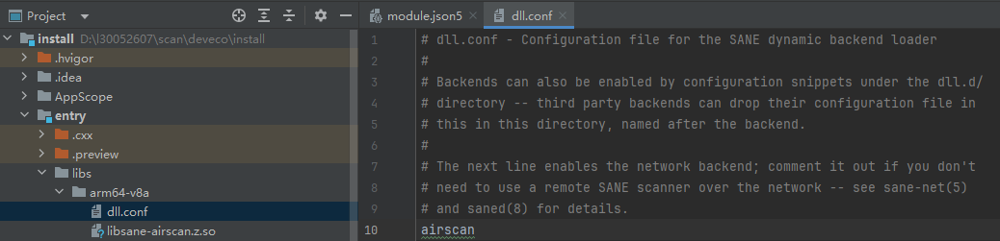

# OpenHarmony打印&扫描驱动开发指南1.8

**文档版本记录**

| 版本 | 拟制/修订责任人 | 拟制/修订日期 | 修订内容及理由 |
|------|----------------|---------------|----------------|
| 1.0  | 丁宇韩          | 2024.7.10     | 初始版本       |
| 1.1  | 丁宇韩          | 2024.7.29     | 带水印图片重绘；第三章删改部分失效内容；第六章添加DevEco下载权限申请，二进制配置路径介绍；新增第七章文档总结 |
| 1.2  | 丁宇韩          | 2024.8.20     | 第六章更新驱动配置信息<br>第七章文档总结新增应用上架相关官方文档链接供参考 |
| 1.3  | 丁宇韩          | 2024.9.6      | 第六章新增驱动配置的cupsBackend相关说明 |
| 1.4  | 丁宇韩          | 2024.10.9     | 第六章新增驱动安装失败的解决方法 |
| 1.5  | 刘昊苏          | 2024.12.2     | 第五章新增扫描仪驱动编译配置脚本 |
| 1.6  | 刘昊苏          | 2025.1.7      | 第五章新增OpenHarmony驱动规范和驱动日志打印内容 |
| 1.7  | 包泽伟          | 2025.7.22     | 第四章新增OpenHarmony打印驱动backend编译配置 |
| 1.8  | 刘昊苏          | 2025.7.24     | 第五章补充扫描驱动安装相关内容 |

## 目录

[OpenHarmony打印&扫描驱动开发流程介绍](#OpenHarmony打印扫描驱动开发流程介绍)

[第二章 OpenHarmony打印&扫描子系统介绍](#第二章-OpenHarmony打印扫描子系统介绍)

[第三章 配置系统组件代码编译环境](#第三章-配置系统组件代码编译环境)

[第四章 打印厂商驱动代码置入系统组件内编译](#第四章-打印厂商驱动代码置入系统组件内编译)

[第五章 扫描厂商驱动代码置入系统组件内编译](#第五章-扫描厂商驱动代码置入系统组件内编译)

[第六章 驱动安装程序开发](#第六章-驱动安装程序开发)

[第七章 文档总结](#第七章-文档总结)

## OpenHarmony打印&扫描驱动开发流程介绍


开发OpenHarmony打印&扫描驱动需要两个设备，工作电脑和样机；工作电脑的主要任务是进行驱动二进制文件的编译生成和驱动安装应用的开发，样机的主要任务是推送或者安装打印&扫描驱动后验证驱动在OpenHarmony系统上的打印能力，验收驱动的OpenHarmony化适配的效果。

工作电脑通过创建ubuntu虚拟机，在ubuntu环境下配置OpenHarmony系统组件代码编译环境，置入厂商驱动代码，编译生成驱动二进制文件。同时工作电脑安装OpenHarmony应用开发工具DevEco，基于OpenHarmony应用开发工具DevEco开发驱动安装应用，驱动安装应用的主要功能是将驱动二进制文件推送入样机中，实现OpenHarmony系统的打印能力扩展。

工作电脑需要尽量高的配置，内存推荐16GB以上，硬盘可用存储推荐300G以上，配置高低决定了编译整个OpenHarmony系统组件的时间，影响开发效率。同时，也可以使用纯ubuntu系统的工作电脑进行环境搭建和编译，可以提升一点编译速度，但是开发OpenHarmony应用仍然需要windows系统。

## 第二章 OpenHarmony打印&扫描子系统介绍

### 2.1. 打印系统架构简介


### 2.2. 打印应用层

（1）三方应用：使用打印功能的应用，主要有图库等应用；

（2）打印预览应用（PrintSpooler）：系统打印预览界面，提供图片预览，打印机发现连接（P2P&MDNS），打印设置，执行打印等能力；

（3）三方打印驱动应用：基于 CUPS 打印系统的打印机驱动实现；

### 2.3. 打印服务

（1）PrintManagerClient：向应用层提供 ArkTs 或在 C/C++ 接口；

（2）PrintServiceAbility：OH 系统打印服务

### 2.4. CUPS

（1）CUPS（Common Unix Printing System）是一种开源打印系统，现在由 OpenPrinting 组织维护。CUPS 主要功能包括打印队列管理、打印驱动程序管理、网络打印支持等。

（2）基于开源 CUPS 打印系统，OpenHarmony 进行适配，保留 CUPS 核心能力。

### 2.5. 打印相关链接

- [PrintSpooler](https://gitee.com/openharmony/applications_print_spooler)
- [打印框架](https://gitee.com/openharmony/print_print_fwk)
- [CUPS](https://gitee.com/openharmony/third_party_cups)
- [CUPS-Filters](https://gitee.com/openharmony/third_party_cups-filters)

Ps: [章节参考文档](https://forums.openharmony.cn/forum.php?mod=viewthread&tid=1003&extra=)

### 2.6. 扫描子系统简介


### 2.7. 扫描应用层

系统应用：系统内置扫描应用，可以使用基础的扫描功能

三方应用：三方设备厂商可开发带有用户界面和驱动安装能力的应用，实现更强大的扫描能力

### 2.8. 扫描框架层

ScanManagerClient：提供Js到C++数据类型转换

ScanService：扫描服务，提供扫描服务能力接口

### 2.9. SANE

SANE驱动：安装驱动可以由三方安装到设备中

### 2.10. 扫描相关链接

[扫描参考文档](https://forums.openharmony.cn/forum.php?mod=viewthread&tid=2378&extra=)

## 第三章 配置系统组件代码编译环境

### 3.1. 参考文档

[官方文档](https://docs.openharmony.cn/pages/v4.1/zh-cn/device-dev/quick-start/quickstart-pkg-prepare.md)

[社区文档](https://forums.openharmony.cn/forum.php?mod=viewthread&tid=897)

### 3.2. 预备工作

1. 安装虚拟机工具VMware或者VirtualBox。
2. 新建虚拟机，内存16GB及以上，硬盘300GB及以上。
3. 安装Ubuntu，推荐使用20.04版本。用户名不能包含中文。
4. 启动并进入Ubuntu虚拟机，以下步骤将在Ubuntu虚拟机中进行操作。

### 3.3. 将Shell环境修改为bash

打开终端工具，执行如下命令，输入密码，然后选择No，将Ubuntu shell由dash修改为bash。

```bash
sudo dpkg-reconfigure dash
```

选择"No"。


### 3.4. 替换Ubuntu软件源

在"[https://mirrors.ustc.edu.cn/repogen/](https://mirrors.ustc.edu.cn/repogen/)"下载对应版本。


在下载好的文件（sources.list）所在的位置开启一个终端窗口，执行下列命令。

备份原始文件：

```bash
sudo cp /etc/apt/sources.list /etc/apt/source.list.bak
```

替换源：

```bash
sudo mv -f sources.list /etc/apt/
```

更新软件包索引：

```bash
sudo apt update
```

### 3.5. 安装必要的库和工具

打开终端工具，执行如下命令

参考"[build仓](https://gitee.com/openharmony/build)"安装编译所需的程序包。

### 3.6. 配置Python

设置默认Python解释器，python和python3软链接为python3.8：

```bash
sudo update-alternatives --install /usr/bin/python python /usr/bin/python3.8 1
sudo update-alternatives --install /usr/bin/python3 python3 /usr/bin/python3.8 1
python --version
```

安装python包管理工具（pip3）：

```bash
sudo apt install python3-pip
```

配置pip软件包更新源：

```bash
mkdir ~/.pip
pip3 config set global.index-url https://mirrors.huaweicloud.com/repository/pypi/simple
pip3 config set global.trusted-host mirrors.huaweicloud.com
pip3 config set global.timeout 120
```

### 3.7. 远程访问准备

当在Windows下进行开发时，开发者需要访问Ubuntu环境下的源码和镜像文件。您可以使用习惯的文件传输或共享工具实现文件的共享或传输。

此处介绍通过Samba服务器进行连接的操作方法。

#### 3.7.1. 配置Samba服务器

在Ubuntu终端工具下进行以下操作：

（1）安装Samba软件包。

```bash
sudo apt-get install samba samba-common
```

（2）修改Samba配置文件，配置共享信息。打开配置文件：

```bash
sudo gedit /etc/samba/smb.conf
```

（3）在配置文件末尾添加以下配置信息（根据实际需要配置相关内容）：

```
[Share] #在Windows中映射的根文件夹名称（此处以"Share"为例）
comment = Shared Folder #共享信息说明
path = /home/share #共享目录
valid users = username #可以访问该共享目录的用户（Ubuntu的用户名）
directory mask = 0775 #默认创建的目录权限
create mask = 0775 #默认创建的文件权限
public = yes #是否公开
writable = yes #是否可写
available = yes #是否可获取
browseable = yes #是否可浏览
```

注意事项：实际配置时"#"及其后面的注释需要去掉。

（4）添加Samba服务器用户和访问密码。

```bash
sudo smbpasswd -a username #username替换为Ubuntu用户名。输入命令后，根据提示设置密码。
```

（5）重启Samba服务。

```bash
sudo service smbd restart
```

#### 3.7.2. 设置Windows映射

在Windows环境下进行以下操作：

（1）右键计算机选择映射网络驱动器，输入共享文件夹信息。在文件夹输入框填入Ubuntu设备的IP地址和Ubuntu共享文件夹的路径。


（2）输入Samba服务器的访问用户名和密码（在配置Samba服务器时已完成配置）。


1. 用户名和密码输入完成后即可在Windows下看到Linux的共享目录，并可对其进行访问。

### 3.8. 获取源码

在Ubuntu环境下通过以下步骤获取OpenHarmony源码。

#### 3.8.1. 准备工作

（1）注册码云gitee帐号。

（2）注册码云SSH公钥，请参考[码云帮助中心](https://gitee.com/help/articles/4191)。

（3）安装git客户端和git-lfs。

更新软件源：

```bash
sudo apt-get update
```

通过以下命令安装：

```bash
sudo apt-get install git git-lfs
```

（4）配置用户信息。

```bash
git config --global user.name "yourname"
git config --global user.email "your-email-address"
git config --global credential.helper store
```

注意事项：标黄部分需替换成自己的用户名和邮箱地址

（5）执行如下命令安装码云repo工具。

下述命令中的安装路径以"~/bin"为例，请用户自行创建所需目录。

```bash
mkdir ~/bin
curl https://gitee.com/oschina/repo/raw/fork_flow/repo-py3 -o ~/bin/repo
chmod a+x ~/bin/repo
pip3 install -i https://repo.huaweicloud.com/repository/pypi/simple requests
```

（6）将repo添加到环境变量。

```bash
vim ~/.bashrc # 编辑环境变量
export PATH=~/bin:$PATH # 在环境变量添加repo路径信息
source ~/.bashrc # 应用环境变量
```

#### 3.8.2. 获取方式

发布分支代码相对比较稳定，开发者可基于发布分支代码进行商用功能开发。主干为开发分支，开发者可通过主干获取新特性。

（1）OpenHarmony发布分支代码获取

OpenHarmony各个版本发布分支的源码获取方式请参考[Release-Notes](https://docs.openharmony.cn/pages/v4.1/zh-cn/OpenHarmony-Overview_zh.md)。

（2）OpenHarmony主干代码获取

通过repo + ssh下载（需注册公钥，请参考[码云帮助中心](https://gitee.com/help/articles/4191)）。

#### 3.8.3. 执行prebuilts

在源码根目录下执行prebuilts脚本，安装编译器及二进制工具。

```bash
bash build/prebuilts_download.sh
```

### 3.9. 编译

使用build.sh。命令格式为：

```bash
./build.sh --product-name {product_name} --ccache --build-target {build_target}
```

注意事项：product_name一般使用rk3568,如果编译后的产物需要推送到64位样机上，还需在编译指令后添加`--target-cpu arm64`

## 第四章 打印厂商驱动代码置入系统组件内编译

[参考文档](https://forums.openharmony.cn/forum.php?mod=viewthread&tid=861&extra=)

[驱动代码引入编译配置参考文档](https://gitee.com/openharmony/build/blob/OpenHarmony-v5.1.0-Release/docs/%E7%BC%96%E8%AF%91%E9%85%8D%E7%BD%AE%E6%8C%87%E5%AF%BC%E6%96%87%E6%A1%A3.md)

### 4.1. 前言

OpenHarmony打印系统基于 CUPS 构建打印能力，打印机厂商可以基于 Linux 打印驱动开发经验，将驱动OpenHarmony化适配，编译出 arm64 位的 filter 在样机上调试

### 4.2. OpenHarmony 编译环境搭建（详细步骤见第三章）

（1）准备 ubuntu20.04的编译环境

（2）获取 OpenHamony源码：[获取链接](https://gitee.com/openharmony)

（3）编译 CUPS-Filters 默认的 filter，编译命令：

```bash
./build.sh --product-name rk3568 --build-target third_party/cups-filters:third_party_cupsfilters --target-cpu arm64
```

（4）如果有编译报错，根据报错下载对应依赖解决

### 4.3. 增加驱动 filter 编译配置，编译 arm64 位的 filter

1. 在BUILD.gn的group增加具体的xxxfilter

```gn
group("third_party_cupsfilters") {
  deps = [
    ":cupsfilters",
    ":cupsfilters.convs",
    ":cupsfilters.types",
    ":imagetoraster",
    ":xxxfilter",
  ]
}
```

2. 在BUILD.gn参照imagetoraster添加xxxfilter编译配置

```gn
ohos_executable("xxxfilter") {
  # 源码件
  sources = [
    "$CUPS_FILTERS_CODE_DIR/filter/common.c",
    "$CUPS_FILTERS_CODE_DIR/filter/imagetoraster.c",
  ]
  
  # 依赖
  deps = [
    "//third_party/cups:cups",
    "//third_party/cups-filters:cupsfilters",
  ]
  
  public_configs = [ ":cups_filters_config" ]
  module_install_dir = "$cups_serverbin_dir/filter"
  install_enable = true
  subsystem_name = "$SUBSYSTEM_NAME"
  part_name = "$PART_NAME"
}
```

3. 配置好之后执行编译命令

```bash
./build.sh --product-name rk3568 --build-target third_party/cups-filters:third_party_cupsfilters
```

Ps：如果编译后的产物需要推送到64位样机上，还需在编译指令后添加`--target-cpu arm64`

4. 获取编译好的xxxfilter

编译好的xxxfilter在：`/OH源码目录/out/rk3568/thirdparty/cups-filters/xxxfilter`

### 4.4. 增加驱动 backend 编译配置，编译 arm64 位的 backend

1. 在`/third_party/cups`的BUILD.gn中的group增加具体的xxxbackend

```gn
group("third_party_cups") {
  deps = [
    ":cups-deviced",
    ":cups-driverd",
    ":cups-exec",
    ":cupsd",
    ":cupsfilter",
    ":cupsimage",
    ":ipp",
    ":mime.convs",
    ":mime.types",
    ":rastertopwg",
    ":usb",
    ":xxxbackend",
  ]
}
```

2. 在BUILD.gn参照usb backend添加xxxbackend编译配置

```gn
ohos_executable("xxxbackend") {
  # 源码件
  sources = [
    "$backend_code_dir/xxx.c", # 驱动backend源文件
  ]
  
  # 依赖
  deps = [
    ":cups_action",
    "//third_party/cups:backend",
    "//third_party/cups:cups",
  ]
  
  public_configs = [ ":cups_config" ]
  module_install_dir = "$cups_serverbin_dir/backend"
  install_enable = true
  subsystem_name = "$SUBSYSTEM_NAME"
  part_name = "$PART_NAME"
}
```

3. 配置好之后执行编译命令

```bash
./build.sh --product-name rk3568 --build-target third_party/cups:third_party_cups
```

Ps：如果编译后的产物需要推送到64位样机上，还需在编译指令后添加`--target-cpu arm64`

4. 获取编译好的xxxbackend

编译好的xxxbackend在：`/OH源码目录/out/rk3568/thirdparty/cups/xxxbackend`

## 第五章 扫描厂商驱动代码置入系统组件内编译

### 5.1. 背景

在OpenHarmony系统上使能扫描设备需要完成以下工作：
1. 基于OpenHarmony环境，移植扫描驱动；
2. 开发三方驱动安装Hap应用；
3. 使用系统默认扫描应用进行驱动基础功能验证。

本文中，重点介绍如何基于OpenHarmony环境移植扫描驱动。

### 5.2. 准备工作

移植工作开始前，首先需要配置好OpenHarmony编译环境（详细见第三章），然后还有基于SANE扫描框架开发的驱动代码。

1. 进入到OpenHarmony系统组件代码根目录下的`//third_party`文件夹下
2. 执行命令：
   ```bash
   git clone git@gitee.com:openharmony-sig/third_party_backends.git
   ```
3. 将项目文件夹名`third_party_backends`修改为`backends`
4. 进入`backends`文件夹，添加准备好的SANE扫描驱动代码
5. 找到`//vendor/hihope/rk3568/config.json`文件，在json文件thirdparty子系统里增加标黄部分：

```json
{
  "subsystem": "thirdparty",
  "components": [
    {
      "component": "backends",
      "features": []
    }
  ]
}
```

### 5.3. 移植工作

找到`//third_party/backends/BUILD.gn`文件，在其中添加扫描仪驱动文件的GN编译命令。以编译fujitsu驱动为例，在`//third_party/backends/BUILD.gn`里添加动态库所需要的配置：

```gn
ohos_shared_library("sane-fujitsu") { # 动态库名称格式为sane-驱动名
  sources = [
    "./backend/fujitsu.c", # 驱动源文件
    "./backend/stubs.c", # 所有驱动都需要添加
  ]
  
  public_configs = [ ":backends_public_config" ]
  configs = [ ":backends_private_config" ]
  defines = ["BACKEND_NAME=fujitsu"] # 驱动名
  
  deps = [
    ":lib",
    ":sanei_init_debug",
    ":sanei_constrain_value",
    ":sanei_config",
    ":sanei_config2",
    ":sanei_usb",
    ":sanei_scsi",
    ":sanei_magic",
    ":sane_strstatus",
  ]
  
  external_deps = [
    "libusb:libusb", # 依赖libusb部件
    "hilog:libhilog" # 依赖hilog部件
  ]
  
  ldflags = ["-lm"]
  subsystem_name = "thirdparty"
  part_name = "backends"
}

group("third_sane") {
  deps = [
    ":sane",
    ":sane-fujitsu" # 编译fujitsu驱动
  ]
}
```

### 5.4. 成果物

执行以下命令进行编译：

```bash
./build.sh --product-name rk3568 --gn-argsis_debug=true --build-target backends --target-cpu arm64
```

编译结束后，在`//out/rk3568/thirdparty/backends`目录中可以找到SANE的相关编译产物`libsane-xxx.z.so`。以fujitsu为例，其中的`libsane-fujitsu.z.so`就是需要的驱动动态库文件。

### 5.5. OpenHarmony驱动规范

#### 5.5.1 扫描仪name

```c
typedef struct
{
  SANE_String_Const name; /* unique device name */
  SANE_String_Const vendor; /* device vendor string */
  SANE_String_Const model; /* device model name */
  SANE_String_Const type; /* device type (e.g., "flatbed scanner") */
} SANE_Device;
```

基于`sane_get_devices`接口获取到的`SANE_Device`结构体表示扫描仪的设备信息，该结构体里的`name`字段作为`sane_open`的入参用于连接扫描仪。

`name`字段中包含驱动文件名和ip地址/usb总线设备地址，需要满足正则格式才能被扫描服务解析并上报。

- 网络扫描仪：`R"(([^ ]+) (\d{1,3}\.\d{1,3}\.\d{1,3}\.\d{1,3}) ([^ ]+))"`
- USB扫描仪：`R"(([a-zA-Z0-9_]+):(libusb):([0-9]{3}):([0-9]{3}))"`

以富士通扫描仪驱动为例：
- 网络扫描仪："fujitsu:tcp 192.168.223.1 net"。其中fujitsus是驱动名，"192.168.223.1"是扫描仪实际的ipv4地址。
- USB扫描仪："fujitsu:libusb:002:003"。其中fujitsus是驱动名，"002:003"是扫描仪在 USB 总线上的总线号和设备地址，分别表示总线编号和设备地址。

#### 5.5.2 扫描仪参数

扫描仪的参数依照SANE标准定义，具体选项可以参考`backends\include\sane\saneopts.h`文件。

存储扫描仪参数的`SANE_Option_Descriptor`结构体中的`name`和`title`都应设置正确的值才能被应用解析，选取其中的值显示并提供用户选择。

| name | title | 解释 | value |
|------|-------|------|-------|
| source | Scan source | 扫描模式 | Flatbed |
| | | 自动进纸器 | Automatic Document Feeder |
| | | 双面扫描 | ADF Duplex |
| | | 正面扫描 | ADF Front |
| | | 反面扫描 | ADF Back |
| resolution | Scan resolution | 分辨率 | 75、150、300 |
| | | | 300、600、1200 |
| mode | Scan mode | 色彩模式 | Color |
| | | | Gray |

#### 5.5.3 扫描仪配置文件目录和缓存文件路径

OpenHarmony扫描驱动通过驱动安装程序（见第六章）安装到系统后：
- 配置文件存放路径在：`/data/service/el1/public/print_service/sane/config`
- 驱动可以落盘的缓存文件路径在：`/data/service/el2/public/print_service/sane/tmp`

### 5.6. 驱动日志打印

在`sane-backends`里，是通过DBG分不同的level等级打印日志。

在OpenHarmony里，保留了通过DBG打印日志的方式，DBG输入的日志信息会通过hilog部件以sanekit作为tag打印日志。日志打印是Debug级别，使用privae加密打印。

## 第六章 驱动安装程序开发

[参考文档](https://forums.openharmony.cn/forum.php?mod=viewthread&tid=902&extra=)

### 6.1. DevEco Studio 下载和安装

（1）下载 DevEco Studio

### 6.2. 创建 demo 工程

（1）安装成功后打开 DevEco 选项下载 node.js 和 ohpm 选项，执行 Next 然后根据提示安装 SDK


（2）SDK 下载成功后创建项目，选择 Native C++，选择项目基本信息（SDK 使用新的，Model 使用默认的 Stage）


（3）创建项目成功初始化项目资源时可能会出现以下报错，如果出现打开`C:\Users\xxx\.ohpm`，编辑.ohpm文件，添加`strict_ssl=false`，然后重启 DecEcoStudio


### 6.3. 编写 OpenHarmony 打印驱动配置信息

（1）创建 DriverExtensionAbility：在项目根目录`entry/src/main/ets`目录下右键创建`extensionAbility`文件夹，在`extensionAbility`文件夹右键创建`DriverExtensionAbility.ts`文件

```typescript
// @ts-nocheck
import DriverExtension from '@ohos.app.ability.DriverExtensionAbility'

export default class DriverExtensionAbility extends DriverExtension {
  onInit(want) {
    console.log('onInit, want: ' + want);
  }
  
  onRelease() {
    console.log('onRelease');
  }
}
```


（2）将编译好的驱动文件（filter/backend/ppd）文件放入到`entry/libs/arm64-v8a`文件夹中，其中 ppd 中对应 filter 的名字需要拼接上当前应用的包名和 entry 名（确保驱动的唯一性）


（3）在`entry/src/main/module.json5`配置驱动信息

打印驱动安装文件的可选项有filter文件、ppd文件和cupsbackend文件，扫描驱动有sanebackend文件（扫描仪驱动）和saneConfig文件（扫描仪配置文件）。

1. 打印驱动文件安装选项：
   - filter文件：
     ```json
     {
       "name": "cupsFilter",
       "value": "/print_service/cups/serverbin/filter",
       "resource": "/libs/arm64-v8a/rastertopwg"
     }
     ```
   - ppd文件：
     ```json
     {
       "name": "cupsPpd",
       "value": "/print_service/cups/datadir/model",
       "resource": "/libs/arm64-v8a/PixLab_X1.ppd"
     }
     ```
   - cupsbackend文件：
     ```json
     {
       "name": "cupsBackend",
       "value": "/print_service/cups/serverbin/backend",
       "resource": "/libs/arm64-v8a/lpd"
     }
     ```

2. 扫描驱动文件安装选项：
   - sanebackend文件：
     ```json
     {
       "name": "saneBackend",
       "value": "/print_service/sane/backend",
       "resource": "/libs/arm64-v8a/libsane-pantum6500.z.so"
     }
     ```
   - saneConfig文件：
     ```json
     {
       "name": "saneConfig",
       "value": "/print_service/sane/config",
       "resource": "/libs/arm64-v8a/dll.conf"
     }
     ```

完整示例：

```json
{
  "module": {
    "name": "entry",
    "type": "entry",
    "description": "$string:module_desc",
    "mainElement": "EntryAbility",
    "deviceTypes": [
      "default",
      "tablet"
    ],
    "deliveryWithInstall": true,
    "installationFree": false,
    "pages": "$profile:main_pages",
    "abilities": [
      {
        "name": "EntryAbility",
        "srcEntry": "./ets/entryability/EntryAbility.ts",
        "description": "$string:EntryAbility_desc",
        "icon": "$media:icon",
        "label": "$string:EntryAbility_label",
        "startWindowIcon": "$media:icon",
        "startWindowBackground": "$color:start_window_background",
        "exported": true,
      }
    ],
    "extensionAbilities": [
      {
        "name": "DriverExtensionAbility",
        "srcEntry": "./ets/extensionAbility/DriverExtensionAbility.ts",
        "label": "$string:EntryAbility_label",
        "icon": "$media:icon",
        "description": "driver",
        "type": "driver",
        "exported": false,
        "metadata": [
          {
            "name": "desc",
            "value": "xxx printer driver"
          },
          {
            "name": "vendor",
            "value": "xx company"
          },
          {
            "name": "cupsFilter",
            "value": "/print_service/cups/serverbin/filter",
            "resource": "/libs/arm64-v8a/rastertopwg"
          },
          {
            "name": "cupsPpd",
            "value": "/print_service/cups/datadir/model",
            "resource": "/libs/arm64-v8a/PixLab_X1.ppd"
          },
          {
            "name": "saneBackend",
            "value": "/print_service/sane/backend",
            "resource": "/libs/arm64-v8a/libsane-pantum6500.z.so"
          },
          {
            "name": "saneConfig",
            "value": "/print_service/sane/config",
            "resource": "/libs/arm64-v8a/dll.conf"
          },
          {
            "name": "cupsBackend",
            "value": "/print_service/cups/serverbin/backend",
            "resource": "/libs/arm64-v8a/lpd"
          }
        ]
      }
    ]
  }
}
```

注意事项：扫描仪驱动配置文件的`dll.conf`文件是必选项，该文件里填写扫描驱动名（见5.3章）。


（4）在`entry`下的`build-profile.json5`文件中的`buildOption`属性下添加如下字段（可解决部分驱动安装失败的问题）：

```json
"nativeLib": {
  "collectAllLibs": true,
  "debugSymbol": {
    "strip": true,
    "exclude": []
  }
}
```

（5）此时直接执行 build/build hap/build hap 若报错，需要修改 SDK 配置信息

（5.1）ctrl+ 鼠标左键点击 extensionAbilities 下的 type 属性，在 SDK 的 module.json 里面的 preview 类型下面新增 driver（弹出是否编辑选是确定）


（5.2）ctrl+ 鼠标左键点击 resource 属性，将匹配规则 pattern 修改为：（注意 w-前面的转移字符以及结尾处可能会有的\n 字符）

```
(^[$]profile:[0-9a-zA-Z_.]+|(?=.*[{])(?=.*[}])[0-9a-zA-Z_.{}]+)|(^(/[\w-]+)+(.[a-z]+)?)$|.*
```


（5.3）两处修改完毕，重启 DevEco Studio

（6）配置自动签名


登录账号后配置签名


### 6.4. 编译驱动 HAP 包

（1）执行 build-->build hap-->build hap


### 6.5. 驱动 HAP 安装

（1）rk3568 环境准备

（2）下载 OpenHarmony 4.0 Release 刷机包，选择 dayu200 的镜像包，[下载链接](http://ci.openharmony.cn/workbench/cicd/dailybuild/dailylist)

（3）在 Terminal 执行

```bash
hdc install -r .\entry-default-signed.hap
```

Ps：如果样机已刷机只需执行第三步


结果显示安装成功

## 第七章 文档总结

本章将对本文所使用到的官网文档做一下总结和说明，如果在阅读文档过程中有疑惑的地方，可以参考官网标准文档。

[设备开发文档](https://docs.openharmony.cn/pages/v4.1/zh-cn/device-dev/device)