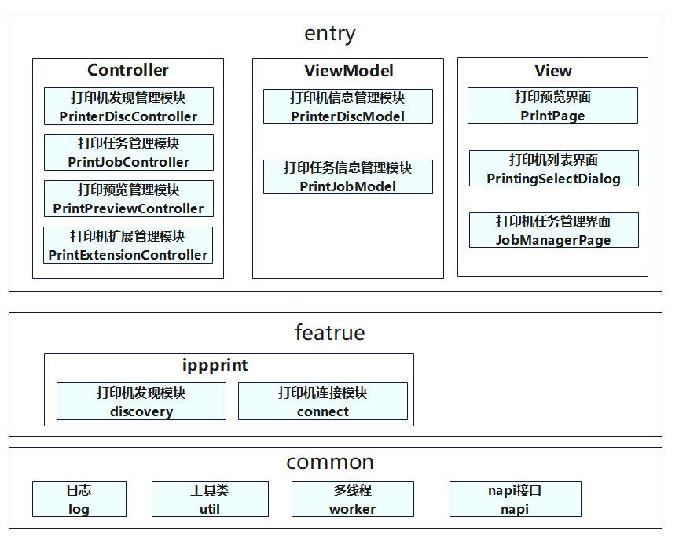

# Spooler<a name="EN-US_TOPIC_0000001103330836"></a>

-   [Introduction](#section11660541593)
    -   [Architecture](#section125101832114213)

-   [Directory Structure](#section161941989596)
-   [Repositories Involved](#section1371113476307)

## Introduction<a name="section11660541593"></a>

Spooler is a system app preinstalled in OpenHarmony. It provides users with functions such as print preview, discovering and connecting printers, setting print parameters, issuing print tasks, and managing print tasks.

### Architecture<a name="section125101832114213"></a>



## Directory Structure<a name="section161941989596"></a>

```
/applications/standard/print_spooler
©À©¤©¤ figures                     # Architecture figures
©À©¤©¤ entry                       # Main entry module code
©À©¤©¤ signature                   # Certificate files
©À©¤©¤ LICENSE                     # License files
©À©¤©¤ features
©¦   ©À©¤©¤ ippPrint                # ipp print
```


