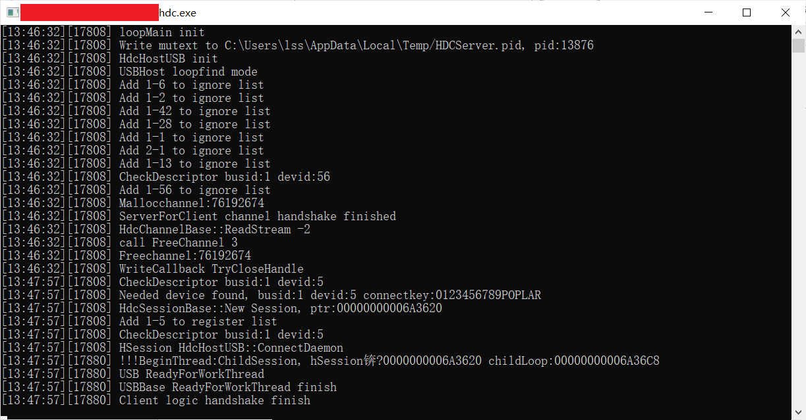

# PrintSpooler<a name="ZH-CN_TOPIC_0000001103330836"></a>

-   [简介](#section11660541593)
    -   [架构图](#section125101832114213)
-   [目录](#section161941989596)
-   [使用说明](#section123459000)
-   [相关仓](#section1371113476307)

## 简介<a name="section11660541593"></a>

PrintSpooler应用是OpenHarmony中预置的系统应用，为用户提供打印预览、发现和连接打印机、打印参数设置、下发打印任务以及打印任务状态的管理等功能。

### 约束限制
当前只支持对接支持ipp无驱动打印协议的打印机，需要单独安装驱动的打印机暂不支持对接。

### 架构图<a name="section125101832114213"></a>


## 目录<a name="section161941989596"></a>

```
/applications/standard/print_spooler
    ├── LICENSE                         # 许可文件
    ├── common                          # 通用工具类目录
    ├── entry                           # entry模块目录
    ├── signature                       # 证书文件目录
    ├── features                        # 子组件目录
    │   ├── ippPrint                    # 局域网打印组件   

```
### 

## 基础开发说明
### 资源引用
#### 定义资源文件
- 在 `src/main/resources/`目录下，根据不同的资源类型，定义资源文件。

  ```json
      {
        "name": "default_background_color",
        "value": "#F1F3F5"
      },
  ```
#### 引用资源
- 在有对应page的ets文件中，可直接通过`$r()`引用。
  ```` JavaScript
  @Provide backgroundColor: Resource = $r('app.color.default_background_color');
  ````
## 典型接口的使用
打印框架启动打印界面:

   ```
    std::string jobId = GetPrintJobId();
    auto printJob = std::make_shared<PrintJob>();
    if (printJob == nullptr) {
        return E_PRINT_GENERIC_FAILURE;
    }
    printJob->SetFdList(fdList);
    printJob->SetJobId(jobId);
    printJob->SetJobState(PRINT_JOB_PREPARED);
    AAFwk::Want want;
    want.SetElementName(SPOOLER_BUNDLE_NAME, SPOOLER_ABILITY_NAME);
    want.SetParam(LAUNCH_PARAMETER_JOB_ID, jobId);
    want.SetParam(LAUNCH_PARAMETER_FILE_LIST, fileList);
    BuildFDParam(fdList, want);
    int32_t callerTokenId = static_cast<int32_t>(IPCSkeleton::GetCallingTokenID());
    std::string callerPkg = DelayedSingleton<PrintBMSHelper>::GetInstance()->QueryCallerBundleName();
    ingressPackage = callerPkg;
    int32_t callerUid = IPCSkeleton::GetCallingUid();
    int32_t callerPid = IPCSkeleton::GetCallingPid();
    want.SetParam(AAFwk::Want::PARAM_RESV_CALLER_TOKEN, callerTokenId);
    want.SetParam(AAFwk::Want::PARAM_RESV_CALLER_UID, callerUid);
    want.SetParam(AAFwk::Want::PARAM_RESV_CALLER_PID, callerPid);
    want.SetParam(CALLER_PKG_NAME, callerPkg);
    if (!StartAbility(want)) {
        PRINT_HILOGE("Failed to start spooler ability");
        return E_PRINT_SERVER_FAILURE;
    }
   ```

## 打印能力指南
### 支持预览界面显示预览图并根据设置动态刷新
- `entry/src/main/ets/Common/Utils/FileUtil.ts `
- 打开传入的图片uri，获得fd并生成imageSource
  ```
  import Fileio from '@ohos.file.fs';
  import image from '@ohos.multimedia.image';
 
  file = Fileio.openSync(uri, Constants.READ_WRITE);
  let imageSource = image.createImageSource(file.fd);
  imageArray.push(new FileModel(<number> file.fd, <string> file.fd, <string> uri,
  <number> imageInfo.size.width, <number> imageInfo.size.height, imageSource));
  ```

- `entry/src/main/ets/pages/component/PreviewComponent.ets`
- 动态变量imageSorce数组更新时，触发handleImage，调用parseImageSize，
- fdToPixelMap生成pixelMap更新this.currentPixelMap，Image组件显示图片
- 彩色、无边距等设置项使用组件属性完成动态刷新；
- 其它设置项变化事件中调用parseImageSize调整或重新加载图片。
  ```
  @Link @Watch('handleImage')  imageSources: Array<FileModel>
  @State currentPixelMap: PixelMap = undefined;
  
    Image(this.currentPixelMap).key('PreviewComponent_Image_currentPixelMap')
    .width(this.canvasWidth).height(this.canvasHeight)
    .backgroundColor($r('app.color.white'))
    .objectFit(this.isBorderless?ImageFit.Cover:ImageFit.Contain)
    .renderMode(this.colorMode === ColorMode.COLOR ? ImageRenderMode.Original : ImageRenderMode.Template)

    handleImage(){
    Log.info(TAG,'handleImage'+this.imageSources.length)
    this.checkCanvasWidth()
    this.parseImageSize(false);
  }
  
    parseImageSize(isRendered: boolean) {
    this.originalIndex = this.printRange[this.currentIndex - 1]
    this.currentImage = this.imageSources[this.originalIndex - 1];
    if (CheckEmptyUtils.isEmpty(this.currentImage)){
      return;
    }
    if (!isRendered) {
      this.fdToPixelMap(this.currentImage.fd);
    }
    let width = this.currentImage.width
    let height = this.currentImage.height
    if(width > height) {
      this.imageOrientation = PageDirection.LANDSCAPE  //图片横向
    } else {
      this.imageOrientation = PageDirection.VERTICAL //图片竖向
    }
    this.updateCanvasSize()
  }
  ```
### 支持打印任务管理，显示打印任务状态及错误信息
-`entry/src/main/ets/pages/JobManagerPage.ets`
-任务管理界面加载时，根据任务id创建本地任务，用@StorageLink动态监控打印任务队列变化，任务有更新后刷新界面显示；

  ```
    @StorageLink('JobQueue') jobQueue: Array<PrintJob> = new Array();
    
    List() {
      ForEach(this.jobQueue, (printJob:PrintJob)=>{
        ListItem(){
          printJobComponent({ mPrintJob: printJob});
        }.key(`JobManagerPage_ListItem_${printJob.jobId}`)
      }, printJob=>printJob.jobId)
    }
    
    aboutToAppear() {
        this.abilityContext = GlobalThisHelper.getValue<common.UIAbilityContext>(GlobalThisStorageKey.KEY_JOB_MANAGER_ABILITY_CONTEXT)
        let data = {
          wantJobId : Constants.STRING_NONE
        }
        this.abilityContext.eventHub.emit(Constants.EVENT_GET_ABILITY_DATA, data);
        this.jobId = data.wantJobId;
        this.adapter = PrintAdapter.getInstance();
        this.adapter.getPrintJobCtl().createPrintJob(this.jobId)
  }
  ```

- `entry/src/main/ets/Controller/PrintJobController.ets`
- 初始化时将本地任务队列存入AppStorage，建立和界面@StorageLink的关联；
- 通过print.on接口，传入回调监听任务状态更新事件；
- 状态更新时通过更新本地任务队列，@StorageLink动态刷新界面
  ```
  public init(): void {
    AppStorageHelper.createValue<Array<PrintJob>>(this.getModel().mPrintJobs, AppStorageKeyName.JOB_QUEUE_NAME);
    this.registerPrintJobCallback();
  }
  
  private registerPrintJobCallback(): void {
    print.on('jobStateChange', this.onJobStateChanged);
  }

  private onJobStateChanged = (state: print.PrintJobState, job: print.PrintJob): void => {
    if (state === null || job === null) {
      Log.error(TAG, 'device state changed null data');
      return;
    }
    this.deleteLocalSource(<number>state, <string>job.jobId);
    switch (state) {
      case PrintJobState.PRINT_JOB_PREPARED:
      case PrintJobState.PRINT_JOB_QUEUED:
      case PrintJobState.PRINT_JOB_RUNNING:
      case PrintJobState.PRINT_JOB_BLOCKED:
      case PrintJobState.PRINT_JOB_COMPLETED:
        this.onPrintJobStateChange(job);
        break;
      default:
        break;
    }
  };

  private onPrintJobStateChange(job: print.PrintJob): void {
    if (job === null) {
      return;
    }
    this.getModel().printJobStateChange(job.jobId, job.jobState, job.jobSubState);
  }
  ```
### 打印需支持mopria协议，支持p2p连接
- `feature/ippPrint/src/main/ets/common/discovery/P2pDiscoveryChannel.ts`
- 调用Wifi-P2p的接口发现周边的p2p打印机
  ```
  import wifi from '@ohos.wifi';
  
  startDiscovery(callback: (found: boolean, peer: wifi.WifiP2pDevice) => void): void {
    this.discoveryCallback = callback;
    wifi.on('p2pPeerDeviceChange', this.updatePeerDevices);
    this.startP2pDiscovery();
    this.registerWifiCommonEvent();

    
    this.discoverySleepTimer = setInterval(()=> {
      Log.debug(TAG, 'native p2p service is sleep, start discovery');
      this.startP2pDiscovery();
    }, DISCOVERY_SLEEP);
  }
    
  private startP2pDiscovery(): void {
    wifi.startDiscoverDevices();
    wifi.getP2pPeerDevices().then((peers: wifi.WifiP2pDevice[]) => {
      this.updatePeerDevices(peers);
    });
  }
  ```
- `feature/ippPrint/src/main/ets/common/connect/P2pPrinterConnection.ts`
- 发现p2p打印机之后，执行连接，获取对端打印机的ip信息
  ```
  import wifi from '@ohos.wifi';
  
  private startConnect(printer: DiscoveredPrinter): void {
    Log.debug(TAG, 'connect to ' + CommonUtils.getSecurityMac(printer.getDeviceAddress()));
    let config: wifi.WifiP2PConfig = this.configForPeer(printer);
    this.mWifiModel.registerWifiP2pEvent(WifiModel.p2pConnectionChange, this.p2pConnectionChangeReceive);
    this.mWifiModel.registerWifiP2pEvent(WifiModel.p2pPeerDeviceChange, this.p2pPeersChangeReceive);
    let connectionOperation: boolean = this.mWifiModel.connectToPrinter(config);
    if (!connectionOperation) {
      Log.error(TAG, 'connection operation failed');
      if (this.delayTimer !== undefined) {
        clearTimeout(this.delayTimer);
      }
      this.mWifiModel.unregisterWifiP2pEvent(WifiModel.p2pConnectionChange, this.p2pConnectionChangeReceive);
      this.mWifiModel.unregisterWifiP2pEvent(WifiModel.p2pPeerDeviceChange, this.p2pPeersChangeReceive);
      this.mListener.onConnectionDelayed();
      return;
    }
    Log.error(TAG, 'connection operation success');
  }
  ```
- `feature/ippPrint/src/main/ets/common/napi/NativeApi.ts`
- p2p打印机连接成功之后调用print_print_fwk的接口获取打印机支持的ipp协议能力，并调用print_print_fwk接口向cupsd服务配置一台无驱动打印机（支持Mopria协议）
  ```
  import print from '@ohos.print';
  
  public getCapabilities(uri: string, printerName: string, getCapsCallback: (result) => void): void {
    Log.debug(TAG, 'getCapabilities enter');
    if (print === undefined) {
      Log.error(TAG, 'print is undefined');
      getCapsCallback(ERROR);
      return;
    }
    Log.debug(TAG, 'getCapabilities start');
    // 获取打印机的ipp打印能力
    print.queryPrinterCapabilityByUri(uri).then((result) => {
      Log.debug(TAG, 'nativeGetCapabilities result: ' + JSON.stringify(result));
      this.setCupsPrinter(uri, this.removeSpaces(printerName));
      getCapsCallback(result);
    }).catch((error) => {
      Log.error(TAG, 'nativeGetCapabilities error: ' + JSON.stringify(error));
      getCapsCallback(ERROR);
    });
    Log.debug(TAG, 'getCapabilities end');
  }

  public setCupsPrinter(uri: string, name: string): void {
    Log.debug(TAG, 'setCupsPrinter enter');
    if (print === undefined) {
      Log.error(TAG, 'print is undefined');
      return;
    }
    // 向cupsd服务配置无驱动打印机
    print.addPrinterToCups(uri, name).then((result) => {
      Log.debug(TAG, 'nativeSetCupsPrinter result: ' + JSON.stringify(result));
    }).catch((error) => {
      Log.error(TAG, 'nativeSetCupsPrinter error: ' + JSON.stringify(error));
    });
  }
  ```
- 打印框架代码详见：[print_print_fwk](https://gitee.com/openharmony/print_print_fwk)

## 签名打包
### 签名
#### 签名文件的获取
1. 拷贝OpenHarmony标准版 工程的 OpenHarmony\signcenter_tool 目录到操作目录
2. 标准版的签名文件下载路径：https://gitee.com/openharmony/signcenter_tool?_from=gitee_search。
3. PrintSpooler 工程的 signature\spooler.p7b 到该目录下
#### 签名文件的配置
打开项目工程，选择 File → Project Structure


选择Project → Signing Configs，将对应的签名文件配置如下，完成后点击Apply，再点击OK。
密码为生成签名文件时的密码，如果使用默认的签名文件，则使用默认密码123456。


## 安装、运行、调试
## 应用安装
配置 hdc：
进入SDK目录中的toolchains文件夹下，获取文件路径：


> 注意，此处的hdc.exe如果版本较老，可能不能正常使用，需要获取新的hdc.exe文件  
> hdc命令介绍与下载详见：[hdc仓库地址](https://gitee.com/openharmony/developtools_hdc_standard)


并将此路径配置到环境变量中：


重启电脑使环境变量生效

连接开发板，打开cmd命令窗口，执行hdc list targets，弹出窗口如下：


等待一段时间后，窗口出现如下打印，可回到输入 hdc list targets 的命令窗口继续操作:



再次输入hdc list targets，出现如下结果，说明hdc连接成功


获取读写权限：

```
hdc target mount 
```
将签名好的 hap 包放入设备的 `/system/app/com.ohos.spooler` 目录下，并修改hap包的权限

```
hdc file send 本地路径 /system/app/com.ohos.spooler/hap包名称
例如：hdc file send Spooler.hap /system/app/com.ohos.spooler/Spooler.hap
```
## 应用运行
Spooler属于系统应用，在将签名的 hap 包放入 `/system/app/com.ohos.spooler` 目录后，重启系统，应用会自动拉起。
```
hdc shell
reboot
（不可以直接执行hdc reboot，命令是无效的)
```
> 注意，如果设备之前安装过系统应用，则需要执行如下两条命令清除设备中存储的应用信息才能够在设备重启的时候将其装入设备的新 hap 包正常拉起。
> ```
> hdc  shell rm -rf  /data/misc_de/0/mdds/0/default/bundle_manager_service
> hdc  shell rm -rf  /data/accounts
> ```
## 应用调试
### log打印
- 在程序中添加 log
```JS
import hilog from '@ohos.hilog';
hilog.info(0x0001, "Spooler", "%{public}s World %{private}d", "hello", 3);
```
### log获取及过滤
- log获取


将log输出至文件
```
hdc shell hilog > 输出文件名称
```

例：
在真实环境查看log，将全log输出到当前目录的hilog.log文件中
```
hdc shell hilog > hilog.log
```

- log过滤

在命令行窗口中过滤log
```
hilog │ grep 过滤信息
```

例：过滤包含信息 Label 的 hilog
```
hilog │ grep Label
```
## 贡献代码
### Fork 代码仓库
1. 在码云上打开 PrintSpooler 代码仓库（[仓库地址](https://gitee.com/openharmony/applications_print_spooler)）。

2. 点击仓库右上角的 Forked 按钮，在弹出的画面中，选择将仓库 fork 到哪里，点击确认。

3. Fork 成功之后，会在自己的账号下看见 fork 的代码仓库。

### 提交代码
1. 访问开发者在码云账号上 fork 的代码仓库，点击“克隆/下载”按钮，选择 SSH/HTTPS，点击“复制”按钮。

2. 在本地新建 PrintSpooler 目录，在 PrintSpooler 目录中执行如下命令
   ```
   git clone 步骤1中复制的地址
   ```

3. 修改代码。

   > 将代码引入工程，以及编译工程等相关内容请参见 **3. 代码使用** 部分的相关内容。
4. 提交代码到 fork 仓库。
   > 修改后的代码，首先执行 `git add` 命令，然后执行 `git commit` 命令与 `git push` 命令，将代码 push 到开发者的 fork 仓中。
   > 关于代码提交的这部分内容涉及 git 的使用，可以参照 [git官网](https://git-scm.com/) 的内容，在此不再赘述。

### 发起 Pull Request (PR)
在将代码提交到 fork 仓之后，开发者可以通过发起 Pull Request（PR）的方式来为 OpenHarmony 的相关项目贡献代码。

1. 打开 fork 仓库。选择 `Pull Requests` → `新建 Pull Request`

2. 在 `新建 Pull Request` 画面填入标题与说明，点击 `创建` 按钮。

3. 创建 Pull Request 完成。 PR 创建完成后，会有专门的代码审查人员对代码进行评审，评审通过之后会合入相应的代码库。
